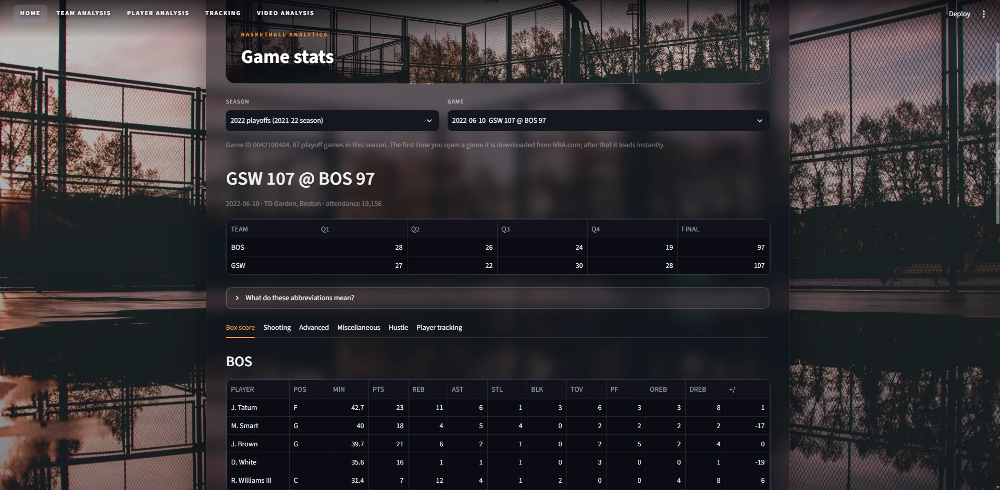
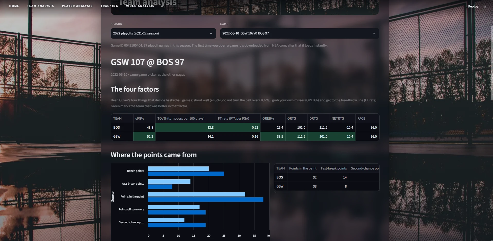
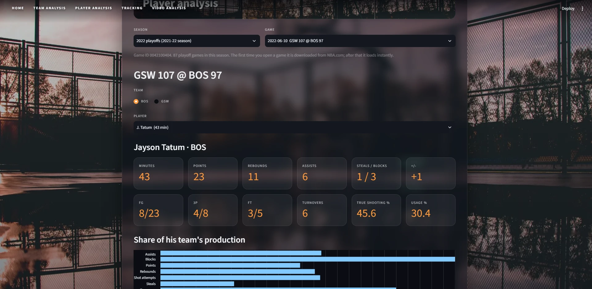
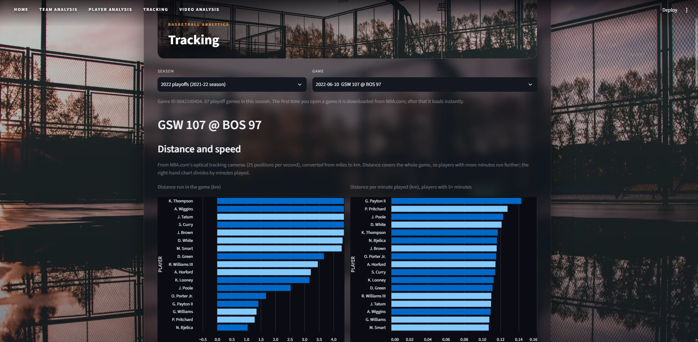

# Basketball analytics: NBA game stats dashboard + video analysis

Two connected parts:

1. **Game stats dashboard.** Pick **any NBA playoff game from 2016 to 2022** and see its full statistics:
   box score, shooting, advanced, miscellaneous, hustle and player-tracking stats for both teams.
2. **Video analysis.** Computer vision on a broadcast clip: object detection (players, referees, ball),
   **passes and interceptions per team**, **ball possession % per team**, **distance and speed of each
   player**, and the camera view translated into a **top-down tactical radar in the top-left corner**.

Everything is free and open source and runs on a laptop CPU.

> **Honesty note.** The video numbers are estimates produced by a pipeline that has no ground-truth
> labels to be scored against. Read "Limitations and failure cases" below before quoting any of them.

## Screenshots

| | |
|---|---|
|  |  |
| **Game stats** (any 2016-2022 playoff game) | **Team analysis** |
|  |  |
| **Player analysis** | **Tracking** |

The tables and charts show NBA.com's statistics for the 2022 Finals, Game 4. The video analysis page is
not pictured because it shows broadcast footage, which is not part of this repository.

## Quick start

```
git clone <your-repo-url>
cd basketball-analytics
python -m venv .venv
.venv\Scripts\activate            # Windows  (macOS/Linux: source .venv/bin/activate)
pip install -r requirements.txt
streamlit run app/main.py         # the game stats work straight away
```

The first time you open a game it is downloaded from NBA.com (about 10 seconds) and cached in
`data/cache/`; after that it opens instantly. Use the sidebar to choose a season (2016-2022 playoffs)
and a game; the choice follows you across pages. The stats pages need no video.

| Page | What it shows (for the selected game) |
|---|---|
| **Home** | Line score and the full stat tables: box score, shooting, advanced, miscellaneous, hustle, player tracking |
| **Team analysis** | The four factors, where the points came from, score margin over the game, biggest scoring runs, shot map and shot zones per team |
| **Player analysis** | One player's headline numbers, share of his team's production, shot map and shot log, hustle and tracking rows, and a side-by-side comparison of any players |
| **Tracking** | NBA.com's optical tracking (distance, speed, touches, passes, rebound chances, contested shots) as charts and tables, plus, when the clip's game is selected, this project's own video tracking and a **frame viewer**: a top-down court with a time slider and a "Play next 10 seconds" button that animates the tracked players and the ball holder |
| **Video analysis** | The annotated clip with radar, passes, interceptions, possession and per-player distance/speed |

Team and player analysis are computed from NBA.com's box-score tables and play-by-play log. The tests
check that, for a real game, the play-by-play final score and every field-goal attempt and make agree with
the official box score. Shot locations are NBA.com's play-by-play coordinates.

## Video analysis

The clip is **your own** broadcast recording; it is **not** in this repository (`data/video/` and all
`.mp4` files are git-ignored). Put it in `data/video/` and set `video.path` in `config.yaml`.

```
pip install -r requirements.txt                 # includes ultralytics (PyTorch) and opencv
python -m scripts.build_references              # one-off: grow the court reference views
python -m scripts.run_detection                 # slow: detect + map + track (~0.7 s/frame on a laptop CPU)
python -m scripts.make_ball_dataset             # self-training labels for the ball (see below)
python -m scripts.train_ball --model yolo11n.pt # fine-tune a ball-only detector on this clip
python -m scripts.run_ball_detection            # find the ball in every analysed frame
python -m scripts.run_analysis                  # teams, players, ball, possession, passes, interceptions
python -m scripts.render_video                  # annotated video with radar and counters
python -m scripts.build_summary                 # refresh the results block in this README
```

The annotated video is shown on the dashboard's **Video analysis** page (local use only: it contains the
broadcast footage).

### How it works, in plain words

* **Detection and tracking.** A COCO-pretrained YOLO model finds people. Only people standing on the
  court are passed to the BoT-SORT tracker, which gives them IDs that survive short occlusions and pans.
  Broken tracks of the same player are then stitched together using their court positions.
* **Court mapping (the radar).** The NBA court is a known rectangle with painted lines. A few frames were
  calibrated by hand (court landmarks: paint corners, three-point arc, centre circle) and more were added
  automatically. Every other frame is matched to the nearest reference with SIFT features, then the
  projected court lines are slid onto the painted white lines. A frame counts as "mapped" only if enough
  features match and the lines line up. Players' feet then become court coordinates in metres.
* **Distance and speed.** Court positions are smoothed (a 0.5 s Savitzky-Golay filter; raw positions
  jitter by tens of centimetres, which differencing would turn into absurd speeds), speeds below
  1.3 km/h count as standing still, and distance is speed times time. The clip has many camera cuts, and a
  player cannot be re-identified across cuts, so each row is one player *within one camera shot*.
* **Teams.** K-means on each track's shirt colour: light kit, dark kit, and grey for referees. Which kit is
  which team was read off the pictures (home Celtics in white, Warriors in dark kits) and is set in
  `config.yaml`.
* **Ball.** The generic detector only finds this ball at very low confidence. The pipeline therefore
  (1) takes the generic model's confident, orange-coloured, non-static detections near a player as
  training labels, (2) fine-tunes a small ball-only YOLO on them, and (3) picks the true ball among all
  candidates by finding the most plausible path through time, ignoring static look-alikes (painted dashes,
  the trophy icon in the score bar).
* **Possession, passes, interceptions.** A player *holds* the ball when the ball sits inside his box for
  at least 5 frames. A team has possession from the moment one of its players starts holding until the
  other team does. A **pass** is a change of holder between two different teammates within 1.5 s and at
  least 1.5 m apart. An **interception** is a change to the other team within 1 s, more than 4.5 m from
  both baskets (so rebounds and inbound passes are excluded; deflections and loose-ball changes are not).

### What the game stats cover

The stats page shows everything NBA.com publishes per game for these groups. NBA.com does **not**
provide, for a single game: PER, Win Shares, drives, time of possession / seconds per touch, potential
assists (only secondary and free-throw assists), catch-and-shoot vs pull-up, or contested-rebound %. The
dashboard lists these on screen instead of inventing them.

## Data sources and attribution

* **Game statistics: NBA.com** (stats.nba.com), fetched with the free
  [`nba_api`](https://github.com/swar/nba_api) package (MIT-licensed code). **The data belongs to NBA.com
  and is covered by NBA.com's Terms of Use**, which I have not reviewed in full; use the stats for personal
  learning and check the terms before any other use. Responses are cached only on your machine
  (`data/cache/`, git-ignored) and are never committed. This project is not affiliated with or endorsed by
  the NBA.
* **Video:** a broadcast recording supplied by the user. The footage remains the rights holder's. It, any
  frames cut from it, and the trained ball weights are not part of this repository.
* **Background photo** (`app/static/background.webp`): supplied by the repository owner, who states it is
  free to use. I could not verify its licence or photographer, so add the credit here if you know it, or
  delete the file (the page falls back to a plain dark gradient).
* **Models:** Ultralytics YOLO (AGPL-3.0) with COCO-pretrained weights; check the AGPL terms before
  deploying or redistributing the video code.

<!-- RESULTS:START (generated by scripts/build_summary.py; do not edit) -->

### Video analysis results (clip: 381 s of broadcast footage)


| Quantity | Value |
|---|---|
| Camera shots longer than 1 s that show the court (analysed) | 60 shots, 288 s (76% of the clip) |
| Frames mapped to court metres | 7929 of 8654 analysed frames (92%) |
| Median feature matches / painted-line alignment score of mapped frames | 120 / 2.19 |
| Players labelled per mapped frame (median) | 8.0 |
| Mapped frames with 8+ players labelled | 57% |
| Ball position known (detected or briefly interpolated) | 54% of mapped frames |
| Ball detector | balls_v2.csv |


#### Team statistics from the video (estimates, this clip only)


| team | kit | passes | interceptions | possession_pct | distance_m_tracked_players |
|---|---|---|---|---|---|
| BOS | light | 7 | 4 | 46.3 | 1552.0 |
| GSW | dark | 16 | 5 | 53.7 | 1827.0 |


Official NBA.com context for the same quarter (period 3): steals {'GSW': 1, 'BOS': 1}, turnovers {'GSW': 3, 'BOS': 2}. The clip shows 288 s of court-view footage, and the video 'interceptions' also include deflections and loose-ball changes that the scorer does not log as steals, so these numbers are not expected to match.


#### Per-player distance and speed: 565 tracked player chains; the 8 with most distance


| pid | team_name | seconds_tracked | distance_m | avg_speed_kmh | top_speed_kmh |
|---|---|---|---|---|---|
| s37-p16 | BOS | 15.6 | 31.5 | 7.3 | 19.5 |
| s37-p15 | GSW | 16.5 | 31.4 | 6.8 | 26.8 |
| s3-p13 | GSW | 9.0 | 26.5 | 10.6 | 24.8 |
| s80-p10 | GSW | 14.5 | 25.8 | 6.4 | 21.0 |
| s37-p21 | BOS | 9.0 | 25.7 | 10.2 | 36.3 |
| s7-p9 | GSW | 7.7 | 25.0 | 11.6 | 20.0 |
| s83-p1 | BOS | 8.2 | 24.4 | 10.7 | 24.5 |
| s83-p0 | GSW | 8.1 | 24.1 | 10.7 | 27.1 |


#### Ball detector, checked by eye on random frames (not ground truth)

Selected ball position on 36 random detected frames, judged by eye (one person, no ground-truth labels): the ball is inside the circle in about 30 of 36 frames (83%); 6 are doubtful or wrong (low-confidence frames #2, #5, #11, #12, #24, #25 in the check sheet). The ball position is known in 55% of mapped frames (35% detected, 20% bridged by interpolation of up to 10 frames). Events were also checked by eye: of the 23 detected passes about 17 look plausible (the ball is at the new holder and the previous holder is a teammate); the others are ambiguous. After tightening the holder rule (contested frames get no holder, flip-flop turnovers cancelled) 9 interceptions remain and were not individually verified; the official count for the quarter is 2 steals and 5 turnovers, so interceptions are probably still over-counted and passes under-counted because the ball is invisible in 45% of frames.

<!-- RESULTS:END -->

## Limitations and failure cases

* **No ground truth.** Nobody labelled this clip, so no accuracy figure is claimed. The only checks are by
  eye (ball: see the table above) and a comparison with the official NBA.com steals/turnovers.
* **Only about 70% of the clip is analysed.** Shots that show the court from another camera (close-ups,
  replays, baseline views) are skipped because the court mapping needs the main broadcast angle.
* **The ball is the weak link.** It is invisible (hidden by hands, or small and blurred) in roughly 45% of
  mapped frames. The ball detector was trained on labels the generic model produced itself
  (self-training), and its validation score measures agreement with those labels, not with the truth.
  Consequences: passes are **under-counted** (a pass is missed when the ball vanishes mid-flight) and
  **interceptions are probably over-counted** (deflections, loose balls and a ball hidden between two
  overlapping players can look like a change of team). Treat both as rough indications, not counts.
* **Possession %** is the share of frames since the last detected holder, per team. Frames before the
  first detected holder in a shot count for nobody.
* **Player identity lasts one camera shot.** After a cut, the same person becomes a new row, so the
  per-player distance and speed are for that shot, not for the quarter. Jersey numbers are not read.
* **Distance and speed** depend on the court mapping (about 1 m of position error is typical in the far
  corners) and on smoothing; short sprints are slightly flattened. Players cut off by the frame edge are
  held at their last reliable speed.
* **Team colours** are K-means on shirts; which kit belongs to which team was set by hand in `config.yaml`.
  Similar kits, shadows or players overlapping can mislabel a track.
* **Game stats** are as published by NBA.com. The statistics it does not provide per game are listed on
  the dashboard rather than estimated.
* **Licences.** NBA.com data terms are not reviewed in full; Ultralytics YOLO is AGPL-3.0.
